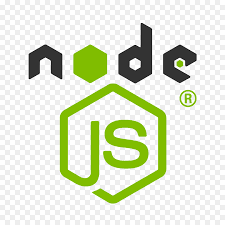

  <a align="right">
    
</a>

 

<p align="center">
    
    
    
    
    
</p>

## Table of Contents

- [Overview](#overview)
- [Built With](#built-with)
- [Installation](#installation)  
- [Lisence](#lisence)
- [Features](#features)
- [Contact](#contact)
- [Acknowledgements](#acknowledgements)

## Overview

```
AS A manager at an internet retail company
I WANT a back end for my e-commerce website that uses the latest technologies
SO THAT my company can compete with other e-commerce companies
```

## Acceptance Criteria

💾   
``` 
GIVEN a functional Express.js API
WHEN I add my database name, MySQL username, and MySQL password to an environment variable file
THEN I am able to connect to a database using Sequelize
WHEN I enter schema and seed commands
THEN a development database is created and is seeded with test data
WHEN I enter the command to invoke the application
THEN my server is started and the Sequelize models are synced to the MySQL database
WHEN I open API GET routes in Insomnia for categories, products, or tags
THEN the data for each of these routes is displayed in a formatted JSON
WHEN I test API POST, PUT, and DELETE routes in Insomnia
THEN I am able to successfully create, update, and delete data in my database
```


### Built With 💻


1.     [nodeJS](https://nodejs.org/en/docs/)

2.     [Sequelize](https://sequelize.org/)

3.     [mySql](https://www.mysql.com/about/legal/logos.html)

4.      [JavaScript]()

5.    [Express](https://expressjs.com/)


## Installation

 **Walk through installation**
 
`npm init`

`npm install mysql2`

`npm install sequelize`

`npm install dotenv`

Run the following command at the root of your project and answer the prompted questions:

`mysql -u root -p`

Enter your password then enster thse comands:

`source db/schema.sql`

`quit`

`npm run seed`
  
`npm start`

## Lisence

 

Copyright © 2007 Free Software Foundation, Inc. <https://fsf.org/>

Everyone is permitted to copy and distribute verbatim copies of this license document, but changing it is not allowed.

## Features
  
*Key features of the application is being able to post to the database, get all data from database, update the database as well as deleting from the database.*


**Products, get-post-put-delete**
  

**Getting all categories and tags**


**Posting/updating/deleting categories**


**Tags post -update-delete**


## Contact

If you would like to contribute or have any questions , please contact me at:


 [Email](mailto:moraadrian510@icloud.com)

 [GitHub](https://github.com/moraadrian510)

## Acknowledgements

1. [askBCS LearningAssistant]()

2.   [StackOverflow](https://stackoverflow.com/)

3.   [YouTube](https://www.youtube.com)

--- 
**Thank You for your feedback!!**

